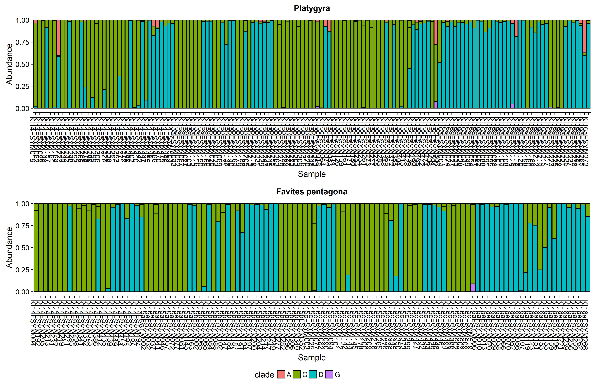
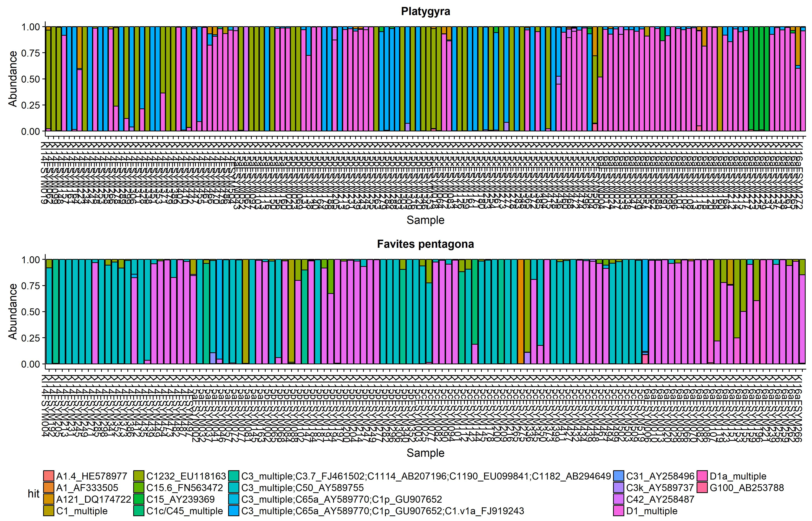

<!-- Setup, import libraries, and load RData -->
```{r setup, include=FALSE}
knitr::opts_chunk$set(echo = TRUE)

library(phyloseq)
library(data.table)
library(VennDiagram)
library(dplyr)
library(ggplot2)
library(gridExtra)
library(grid)
library(cowplot)


rm(list=ls())

load("../data/KI_seqs_f_coral_grouped_all.RData")

# Look at tax_table
tax_table(phy97.f.c)

mycols <- c("#d7191c", "#fdae61", "#ffffbf", "#abdda4", "#2b83ba")

palette(mycols)

clade.colors <- c(A = "#D55E00", C = "#009E73", D = "#56B4E9", F = "#E69F00", G = "#F0E442", Other = "#A9A9A9")

```

<!-- https://github.com/tidyverse/ggplot2/wiki/Share-a-legend-between-two-ggplot2-graphs -->
```{r include=FALSE}
grid_arrange_shared_legend <- function(..., ncol = length(list(...)), nrow = 1, position = c("bottom", "right")) {

  plots <- list(...)
  position <- match.arg(position)
  g <- ggplotGrob(plots[[1]] + theme(legend.position = position))$grobs
  legend <- g[[which(sapply(g, function(x) x$name) == "guide-box")]]
  lheight <- sum(legend$height)
  lwidth <- sum(legend$width)
  gl <- lapply(plots, function(x) x + theme(legend.position="none"))
  gl <- c(gl, ncol = ncol, nrow = nrow)

  combined <- switch(position,
                     "bottom" = arrangeGrob(do.call(arrangeGrob, gl),
                                            legend,
                                            ncol = 1,
                                            heights = unit.c(unit(1, "npc") - lheight, lheight)),
                     "right" = arrangeGrob(do.call(arrangeGrob, gl),
                                           legend,
                                           ncol = 2,
                                           widths = unit.c(unit(1, "npc") - lwidth, lwidth)))

  grid.newpage()
  grid.draw(combined)

  # return gtable invisibly
  invisible(combined)

}
```


# Symbiont alpha-diversity - Grouped by Species  

First, we look at how many *Symbiodinium* types (OTUs) and clades are present in each coral species:

<!-- Calculate OTU and clade diversity by species -->
```{r, include=TRUE, echo=FALSE, cache=TRUE}
# PLATYGYRA  
# Number of OTUs:
platy.ntaxa <- ntaxa(phy97.f.c.platy)
# Number of Clades:
platy.nclades  <- sum(table(unlist(sort((unique((data.frame(tax_table(phy97.f.c.platy))[9])$clade))))))
platy.clades <- levels(unique((data.frame(tax_table(phy97.f.c.platy))[9])$clade))
# FAVITES PENTAGONA  
# Number of OTUs:
favites.ntaxa <- ntaxa(phy97.f.c.fpenta)
# Number of Clades:
favites.nclades <- sum(table(unlist(sort((unique((data.frame(tax_table(phy97.f.c.fpenta))[9])$clade))))))
favites.clades <- levels(unique((data.frame(tax_table(phy97.f.c.fpenta))[9])$clade))
```

# Plot OTU and clade diversity by species
```{r, include=TRUE, echo=FALSE, cache=TRUE}
# Make a data frame including the number of OTUs
df <- data.frame(Platygyra=platy.ntaxa,Favites=favites.ntaxa)
# Add the number of clades to the data frame
df[2,] <- c(platy.nclades,favites.nclades)
# Set the row names
rownames(df) <- c("OTUs","Clades")
# Transpose the data frame
df <- t(df)
# Print the data frame
df

# Create and print a barplot of these data
barplot(df, names.arg=c("OTUs","Clades"), beside=TRUE, legend=rownames(df), col=c("deepskyblue4","darkcyan"),ylim = c(0,max(df)))

# Create a pdf of this plot and save in the 'figures' folder
# Open a new pdf file
pdf(file="../figures/OTUSummary/Diversity_by_Species.pdf")
# Make the plot
barplot(df, names.arg=c("OTUs","Clades"), beside=TRUE, legend=rownames(df), col=c("deepskyblue4","darkcyan"),ylim = c(0,max(df)))
# Close the pdf file
dev.off()

```

# Sample sizes for different coral taxa
```{r, include=TRUE, echo=FALSE, cache=TRUE}
# Number of samples - PLATYGYRA SP.
sum(sample_data(phy97.f.c.coral)$Coral_Species=="Platygyra_sp")
# Number of tagged colonies - PLATYGYRA SP.
unique(sample_data(phy97.f.c.platy)$CoralTag)
#  PLATYGYRA SP.
p1 <- plot_bar(phy97.f.c.platy.p,fill="hit",title = "Platygyra") 
# + scale_fill_manual(values=c(
#   "#a6bddb","#74a9cf","#3690c0","#0570b0", # Clade A
# "#fdd0a2","#fdae6b","#fd8d3c","#f16913","#d94801","#a63603","#7f2704","#a50f15","#cb181d","#ef3b2c","#fb6a4a","#fc9272", # Clade C
# "#fcbba1",  "#74c476","#41ab5d", # Clade D
#   "yellow", # Clade F
#   "purple")) # Clade G

# Number of samples - FAVITES PENTAGONA
sum(sample_data(phy97.f.c.coral)$Coral_Species=="Favites_pentagona")
# Number of tagged colonies - FAVITES PENTAGONA
unique(sample_data(phy97.f.c.fpenta)$CoralTag)
#  FAVITES PENTAGONA
p2 <- plot_bar(phy97.f.c.fpenta.p,fill="hit",title="Favites pentagona")
#+ scale_fill_manual(values=c(
#   "#a6bddb","#74a9cf","#3690c0","#0570b0", # Clade A
# "#fdd0a2","#fdae6b","#fd8d3c","#f16913","#d94801","#a63603","#7f2704","#a50f15","#cb181d","#ef3b2c","#fb6a4a","#fc9272", # Clade C
# "#fcbba1",  "#74c476","#41ab5d", # Clade D
#   "yellow", # Clade F
#   "purple")) # Clade G

# Write new figure to pdf
jpeg(file="../figures/OTUSummary/Combined_Barplot.jpg",height=9, width=14,units = "in", res=300)
# Plot Platygyra and Favites pentagona with a shared legend
grid_arrange_shared_legend(p1, p2, ncol = 1, nrow = 2)
dev.off()

jpeg(file="../figures/OTUSummary/Combined_Barplot_byclade.jpg",height=9, width=14,units="in",res=300)
p4 <- plot_bar(phy97.f.c.platy.p,fill="clade",title = "Platygyra")
p5 <- plot_bar(phy97.f.c.fpenta.p,fill="clade",title="Favites pentagona")
grid_arrange_shared_legend(p4, p5, ncol = 1, nrow = 2)
dev.off()

```

Barplot by *Symbiodinium* Clade - Platygyra and Favites pentagona



Barplot by *Symbiodinium* Hit - Platygyra and Favites pentagona



# Symbiont alpha-diversity - Grouped by Sites (and SampleType)  

  
Next, we look at the number of *Symbiodinium* types (OTUs) and clades in coral at each Kiritimati site:  

<!-- Calculate OTU and clade diversity by site -->
```{r, include=TRUE, echo=FALSE, cache=TRUE}
for (i in unique(data.frame(sample_data(phy97.f.c.coral))$site)){
  nam <- paste("site",i,".coral.ntaxa",sep="")
  nam2 <- paste("site",i,".coral.nclades",sep="")
  nam3 <- paste("site",i,".coral.clades",sep="")
  nam4 <- paste("site",i,".coral.hits",sep="")
  ornam <- get(paste("phy97.f.c.coral.site",i,sep=""))
  a <- eval(ntaxa(ornam))
  assign(nam,a)
  b <- eval(sum(table(unlist(sort((unique((data.frame(tax_table(ornam))[9])$clade)))))))
  assign(nam2,b)
  c <- eval(levels(unique((data.frame(tax_table(ornam))[9])$clade)))
  assign(nam3,c)
  d <- eval(length((unique(data.frame(tax_table(ornam))$hit))))
  assign(nam4,d)
}

for (i in unique(data.frame(sample_data(phy97.f.c.platy))$site)){
  nam <- paste("site",i,".platy.ntaxa",sep="")
  nam2 <- paste("site",i,".platy.nclades",sep="")
  nam3 <- paste("site",i,".platy.clades",sep="")
  nam4 <- paste("site",i,".platy.hits",sep="")
  ornam <- get(paste("phy97.f.c.platy.site",i,sep=""))
  a <- eval(ntaxa(ornam))
  assign(nam,a)
  b <- eval(sum(table(unlist(sort((unique((data.frame(tax_table(ornam))[9])$clade)))))))
  assign(nam2,b)
  c <- eval(levels(unique((data.frame(tax_table(ornam))[9])$clade)))
  assign(nam3,c)
  d <- eval(length((unique(data.frame(tax_table(ornam))$hit))))
  assign(nam4,d)
}

for (i in unique(data.frame(sample_data(phy97.f.c.fpenta))$site)){
  nam <- paste("site",i,".fpenta.ntaxa",sep="")
  nam2 <- paste("site",i,".fpenta.nclades",sep="")
  nam3 <- paste("site",i,".fpenta.clades",sep="")
  nam4 <- paste("site",i,".fpenta.hits",sep="")
  ornam <- get(paste("phy97.f.c.fpenta.site",i,sep=""))
  a <- eval(ntaxa(ornam))
  assign(nam,a)
  b <- eval(sum(table(unlist(sort((unique((data.frame(tax_table(ornam))[9])$clade)))))))
  assign(nam2,b)
  c <- eval(levels(unique((data.frame(tax_table(ornam))[9])$clade)))
  assign(nam3,c)
  d <- eval(length((unique(data.frame(tax_table(ornam))$hit))))
  assign(nam4,d)
}

```

# OTU and Clade Diversity by Site
```{r, include=TRUE, echo=FALSE, cache=TRUE}
df2 <- data.frame(site3=site3.coral.ntaxa,site5=site5.coral.ntaxa,site8=site8.coral.ntaxa,site14=site14.coral.ntaxa,site15=site15.coral.ntaxa,site19=site19.coral.ntaxa,site25=site25.coral.ntaxa,site27=site27.coral.ntaxa,site30=site30.coral.ntaxa,site32=site32.coral.ntaxa,site34=site34.coral.ntaxa,site35=site35.coral.ntaxa,site37=site37.coral.ntaxa,site38=site38.coral.ntaxa,site40=site40.coral.ntaxa)
df2[2,] <- c(site3.coral.nclades,site5.coral.nclades,site8.coral.nclades,site14.coral.nclades,site15.coral.nclades,site19.coral.nclades,site25.coral.nclades,site27.coral.nclades,site30.coral.nclades,site32.coral.nclades,site34.coral.nclades,site35.coral.nclades,site37.coral.nclades,site38.coral.nclades,site40.coral.nclades)
df2[3,] <- c(2,5,3,3,6,6,2,1,1,1,3,3,5,2,1)
df2[4,] <- c(site3.coral.hits,site5.coral.hits,site8.coral.hits,site14.coral.hits,site15.coral.hits,site19.coral.hits,site25.coral.hits,site27.coral.hits,site30.coral.hits,site32.coral.hits,site34.coral.hits,site35.coral.hits,site37.coral.hits,site38.coral.hits,site40.coral.hits)
rownames(df2) <- c("OTUs","Clades", "Dist", "Subclades")
df2 <- t(df2)
df2 <- df2[order(df2[,3]),]
df2


par(xpd=TRUE,mar=c(3,3,3,11))
barplot(df2[,c(1,4,2)], names.arg=c("OTUs","Subclades","Clades"), beside=TRUE, col=df2[,3],ylim = c(0,max(df2)),main="Symbiodinium Alpha Diversity - All Corals by Site")
legend("topright", inset=c(0.05,-0.05), legend=rownames(df2), fill=df2[,3],cex=0.55)


## Now for platy only
df2platy <- data.frame(site3=site3.platy.ntaxa,site5=site5.platy.ntaxa,site8=site8.platy.ntaxa,site14=site14.platy.ntaxa,site15=site15.platy.ntaxa,site25=site25.platy.ntaxa,site27=site27.platy.ntaxa,site30=site30.platy.ntaxa,site32=site32.platy.ntaxa,site34=site34.platy.ntaxa,site35=site35.platy.ntaxa,site37=site37.platy.ntaxa,site38=site38.platy.ntaxa,site40=site40.platy.ntaxa)
df2platy[2,] <- c(site3.platy.nclades,site5.platy.nclades,site8.platy.nclades,site14.platy.nclades,site15.platy.nclades,site25.platy.nclades,site27.platy.nclades,site30.platy.nclades,site32.platy.nclades,site34.platy.nclades,site35.platy.nclades,site37.platy.nclades,site38.platy.nclades,site40.platy.nclades)
df2platy[3,] <- c(2,5,3,3,6,2,1,1,1,3,3,5,2,1)
df2platy[4,] <- c(site3.platy.hits,site5.platy.hits,site8.platy.hits,site14.platy.hits,site15.platy.hits,site25.platy.hits,site27.platy.hits,site30.platy.hits,site32.platy.hits,site34.platy.hits,site35.platy.hits,site37.platy.hits,site38.platy.hits,site40.platy.hits)
rownames(df2platy) <- c("OTUs","Clades", "Dist", "Subclades")
df2platy <- t(df2platy)
df2platy <- df2platy[order(df2platy[,3]),]
df2platy

par(xpd=TRUE,mar=c(3,3,3,11))
barplot(df2platy[,c(1,4,2)], names.arg=c("OTUs","Subclades","Clades"), beside=TRUE, col=df2platy[,3],ylim = c(0,max(df2)),main="Symbiodinium Alpha Diversity - Platygyra by Site")
legend("topright", inset=c(0.05,-0.05), legend=rownames(df2platy), fill=df2platy[,3],cex=0.55)

## Now for fpenta only
df2fpenta <- data.frame(site3=site3.fpenta.ntaxa,site5=site5.fpenta.ntaxa,site8=site8.fpenta.ntaxa,site14=site14.fpenta.ntaxa,site15=site15.fpenta.ntaxa,site19=site19.fpenta.ntaxa,site25=site25.fpenta.ntaxa,site27=site27.fpenta.ntaxa,site30=site30.fpenta.ntaxa,site32=site32.fpenta.ntaxa,site34=site34.fpenta.ntaxa,site35=site35.fpenta.ntaxa,site37=site37.fpenta.ntaxa,site38=site38.fpenta.ntaxa,site40=site40.fpenta.ntaxa)
df2fpenta[2,] <- c(site3.fpenta.nclades,site5.fpenta.nclades,site8.fpenta.nclades,site14.fpenta.nclades,site15.fpenta.nclades,site19.fpenta.nclades,site25.fpenta.nclades,site27.fpenta.nclades,site30.fpenta.nclades,site32.fpenta.nclades,site34.fpenta.nclades,site35.fpenta.nclades,site37.fpenta.nclades,site38.fpenta.nclades,site40.fpenta.nclades)
df2fpenta[3,] <- c(2,5,3,3,6,6,2,1,1,1,3,3,5,2,1)
df2fpenta[4,] <- c(site3.fpenta.hits,site5.fpenta.hits,site8.fpenta.hits,site14.fpenta.hits,site15.fpenta.hits,site19.fpenta.hits,site25.fpenta.hits,site27.fpenta.hits,site30.fpenta.hits,site32.fpenta.hits,site34.fpenta.hits,site35.fpenta.hits,site37.fpenta.hits,site38.fpenta.hits,site40.fpenta.hits)
rownames(df2fpenta) <- c("OTUs","Clades", "Dist", "Subclades")
df2fpenta <- t(df2fpenta)
df2fpenta <- df2fpenta[order(df2fpenta[,3]),]
df2fpenta

par(xpd=TRUE,mar=c(3,3,3,11))
barplot(df2fpenta[,c(1,4,2)], names.arg=c("OTUs","Subclades","Clades"), beside=TRUE, col=df2fpenta[,3],ylim = c(0,max(df2)),main="Symbiodinium Alpha Diversity - F. pentagona by Site")
legend("topright", inset=c(0.05,-0.05), legend=rownames(df2fpenta), fill=df2fpenta[,3],cex=0.55)

```


 <!-- Calculate OTU and clade diversity by Disturbance level -->
```{r, include=TRUE, echo=FALSE, cache=TRUE}
for (i in unique(data.frame(sample_data(phy97.f.c.coral))$Dist)){
  nam <- paste(i,".coral.ntaxa",sep="")
  nam2 <- paste(i,".coral.nclades",sep="")
  nam3 <- paste(i,".coral.clades",sep="")
  nam4 <- paste(i,".coral.hits",sep="")
  ornam <- get(paste("phy97.f.c.coral.",i,sep=""))
  a <- eval(ntaxa(ornam))
  assign(nam,a)
  b <- eval(sum(table(unlist(sort((unique((data.frame(tax_table(ornam))[9])$clade)))))))
  assign(nam2,b)
  c <- eval(levels(unique((data.frame(tax_table(ornam))[9])$clade)))
  assign(nam3,c)
  d <- eval(length((unique(data.frame(tax_table(ornam))$hit))))
  assign(nam4,d)
}

for (i in unique(data.frame(sample_data(phy97.f.c.platy))$Dist)){
  nam <- paste(i,".platy.ntaxa",sep="")
  nam2 <- paste(i,".platy.nclades",sep="")
  nam3 <- paste(i,".platy.clades",sep="")
  nam4 <- paste(i,".platy.hits",sep="")
  ornam <- get(paste("phy97.f.c.platy.",i,sep=""))
  a <- eval(ntaxa(ornam))
  assign(nam,a)
  b <- eval(sum(table(unlist(sort((unique((data.frame(tax_table(ornam))[9])$clade)))))))
  assign(nam2,b)
  c <- eval(levels(unique((data.frame(tax_table(ornam))[9])$clade)))
  assign(nam3,c)
  d <- eval(length((unique(data.frame(tax_table(ornam))$hit))))
  assign(nam4,d)
}

for (i in unique(data.frame(sample_data(phy97.f.c.fpenta))$Dist)){
  nam <- paste(i,".fpenta.ntaxa",sep="")
  nam2 <- paste(i,".fpenta.nclades",sep="")
  nam3 <- paste(i,".fpenta.clades",sep="")
  nam4 <- paste(i,".fpenta.hits",sep="")
  ornam <- get(paste("phy97.f.c.fpenta.",i,sep=""))
  a <- eval(ntaxa(ornam))
  assign(nam,a)
  b <- eval(sum(table(unlist(sort((unique((data.frame(tax_table(ornam))[9])$clade)))))))
  assign(nam2,b)
  c <- eval(levels(unique((data.frame(tax_table(ornam))[9])$clade)))
  assign(nam3,c)
  d <- eval(length((unique(data.frame(tax_table(ornam))$hit))))
  assign(nam4,d)
}

```

# OTU and Clade Diversity by Disturbance Level
```{r, include=TRUE, echo=FALSE, cache=TRUE}
mycols <- c("#d7191c", "#fdae61", "#ffffbf", "#abdda4", "#2b83ba")
palette(mycols)

df2dist <- data.frame(VeryHigh=VeryHigh.coral.ntaxa, High=High.coral.ntaxa, HighMed=HighMed.coral.ntaxa, Low=Low.coral.ntaxa, VeryLow=VeryLow.coral.ntaxa)
df2dist[2,] <- c(VeryHigh.coral.hits,High.coral.hits,HighMed.coral.hits,Low.coral.hits,VeryLow.coral.hits)
df2dist[3,] <- c(VeryHigh.coral.nclades,High.coral.nclades,HighMed.coral.nclades,Low.coral.nclades,VeryLow.coral.nclades)
rownames(df2dist) <- c("OTUs","Clades", "Subclades")
df2dist <- t(df2dist)

par(xpd=TRUE,mar=c(3,3,3,3))
barplot(df2dist[,c(1:3)], names.arg=c("OTUs","Subclades","Clades"), beside=TRUE, col=mycols, ylim = c(0,max(df2dist)), main="Symbiodinium Alpha Diversity - All Corals by Disturbance")
legend("topright", inset=c(0.05,-0.05), legend=rownames(df2dist), fill=mycols,cex=0.55)


## Now for platy only
df2dist.platy <- data.frame(VeryHigh=VeryHigh.platy.ntaxa, High=High.platy.ntaxa, HighMed=HighMed.platy.ntaxa, Low=Low.platy.ntaxa, VeryLow=VeryLow.platy.ntaxa)
df2dist.platy[2,] <- c(VeryHigh.platy.hits,High.platy.hits,HighMed.platy.hits,Low.platy.hits,VeryLow.platy.hits)
df2dist.platy[3,] <- c(VeryHigh.platy.nclades,High.platy.nclades,HighMed.platy.nclades,Low.platy.nclades,VeryLow.platy.nclades)
rownames(df2dist.platy) <- c("OTUs","Clades", "Subclades")
df2dist.platy <- t(df2dist.platy)

par(xpd=TRUE,mar=c(3,3,3,3))
barplot(df2dist.platy[,c(1:3)], names.arg=c("OTUs","Subclades","Clades"), beside=TRUE, col=mycols, ylim = c(0,max(df2dist)), main="Symbiodinium Alpha Diversity - Platygyra by Disturbance")
legend("topright", inset=c(0.05,-0.05), legend=rownames(df2dist.platy), fill=mycols,cex=0.55)

## Now for fpenta only
df2dist.fpenta <- data.frame(VeryHigh=VeryHigh.fpenta.ntaxa, High=High.fpenta.ntaxa, HighMed=HighMed.fpenta.ntaxa, Low=Low.fpenta.ntaxa, VeryLow=VeryLow.fpenta.ntaxa)
df2dist.fpenta[2,] <- c(VeryHigh.fpenta.hits,High.fpenta.hits,HighMed.fpenta.hits,Low.fpenta.hits,VeryLow.fpenta.hits)
df2dist.fpenta[3,] <- c(VeryHigh.fpenta.nclades,High.fpenta.nclades,HighMed.fpenta.nclades,Low.fpenta.nclades,VeryLow.fpenta.nclades)
rownames(df2dist.fpenta) <- c("OTUs","Clades", "Subclades")
df2dist.fpenta <- t(df2dist.fpenta)

par(xpd=TRUE,mar=c(3,3,3,3))
barplot(df2dist.fpenta[,c(1:3)], names.arg=c("OTUs","Subclades","Clades"), beside=TRUE, col=mycols, ylim = c(0,max(df2dist)), main="Symbiodinium Alpha Diversity - F. pentagona by Disturbance")
legend("topright", inset=c(0.05,-0.05), legend=rownames(df2dist.fpenta), fill=mycols,cex=0.55)

```
 
# Symbiont alpha-diversity - Grouped by Field Season  
  
To understand how *Symbiodinium* diversity changes among field seasons, clade diversity is divided by field season. This includes coral-associated *Symbiodinium*.  
  
<!-- Calculate OTU and clade diversity by field season -->
```{r, include=TRUE, echo=FALSE, cache=TRUE}
# 2014  
# Number of OTUs:
KI2014.ntaxa <- ntaxa(phy97.f.c.coral.KI2014)
# Number of Clades:
KI2014.nclades  <- sum(table(unlist(sort((unique((data.frame(tax_table(phy97.f.c.coral.KI2014))[9])$clade))))))
KI2014.clades <- levels(unique((data.frame(tax_table(phy97.f.c.coral.KI2014))[9])$clade))

# 2015 Jan
# Make sure to get rid of empty taxa
phy97.f.c.coral.KI2015a = prune_taxa(taxa_sums(phy97.f.c.coral.KI2015a) > 0, phy97.f.c.coral.KI2015a) 
# Number of OTUs:
KI2015a.ntaxa <- ntaxa(phy97.f.c.coral.KI2015a)
# Number of Clades:
KI2015a.nclades  <- sum(table(unlist(sort((unique((data.frame(tax_table(phy97.f.c.coral.KI2015a))[9])$clade))))))
KI2015a.clades <- levels(unique((data.frame(tax_table(phy97.f.c.coral.KI2015a))[9])$clade))

# 2015 May
# Make sure to get rid of empty taxa
phy97.f.c.coral.KI2015b = prune_taxa(taxa_sums(phy97.f.c.coral.KI2015b) > 0, phy97.f.c.coral.KI2015b) 
# Number of OTUs:
KI2015b.ntaxa <- ntaxa(phy97.f.c.coral.KI2015b)
# Number of Clades:
KI2015b.nclades  <- sum(table(unlist(sort((unique((data.frame(tax_table(phy97.f.c.coral.KI2015b))[9])$clade))))))
KI2015May.clades <- levels(unique((data.frame(tax_table(phy97.f.c.coral.KI2015b))[9])$clade))

# 2015 July
# Make sure to get rid of empty taxa
phy97.f.c.coral.KI2015c = prune_taxa(taxa_sums(phy97.f.c.coral.KI2015c) > 0, phy97.f.c.coral.KI2015c) 
# Number of OTUs:
KI2015c.ntaxa <- ntaxa(phy97.f.c.coral.KI2015c)
# Number of Clades:
KI2015c.nclades  <- sum(table(unlist(sort((unique((data.frame(tax_table(phy97.f.c.coral.KI2015c))[9])$clade))))))
KI2015c.clades <- levels(unique((data.frame(tax_table(phy97.f.c.coral.KI2015c))[9])$clade))

# 2016 March
# Make sure to get rid of empty taxa
phy97.f.c.coral.KI2016a = prune_taxa(taxa_sums(phy97.f.c.coral.KI2016a) > 0, phy97.f.c.coral.KI2016a) 
# Number of OTUs:
KI2016a.ntaxa <- ntaxa(phy97.f.c.coral.KI2016a)
# Number of Clades:
KI2016a.nclades  <- sum(table(unlist(sort((unique((data.frame(tax_table(phy97.f.c.coral.KI2016a))[9])$clade))))))
KI2016a.clades <- levels(unique((data.frame(tax_table(phy97.f.c.coral.KI2016a))[9])$clade))
```

# OTU and Clade Diversity by Field Season
```{r, include=TRUE, echo=FALSE, cache=TRUE}
mycols <- c("lightblue2", "lightblue2", "lightblue2", "orange", "red")
palette(mycols)
# Make a data frame for plotting OTU and clade diversity by Field Season
df3 <- data.frame(KI2014=KI2014.ntaxa,KI2015a=KI2015a.ntaxa,KI2015b=KI2015b.ntaxa,KI2015c=KI2015c.ntaxa,KI2016a=KI2016a.ntaxa)
df3[2,] <- c(KI2014=KI2014.nclades,KI2015a=KI2015a.nclades,KI2015b=KI2015b.nclades,KI2015c=KI2015c.nclades,KI2016a=KI2016a.nclades)
rownames(df3) <- c("OTUs","Clades")
df3 <- t(df3)
# Print the data frame
df3

# Make the plot in the RMD document
par(xpd=TRUE)
barplot(df3, names.arg=c("OTUs","Clades"), beside=TRUE, col=mycols,ylim = (c(0,max(df3)+5)), main="Symbiodinium Alpha Diversity - by Field Season")
legend("topright", legend=rownames(df3), fill=mycols, cex=0.7)

```


# Plot unique Symbiont types by coral taxa
```{r, include=TRUE, echo=FALSE, cache=TRUE}
# Platygyra
# Make sure to get rid of empty taxa
phy97.f.c.platy = prune_taxa(taxa_sums(phy97.f.c.platy) > 0, phy97.f.c.platy) 
phy97.f.c.platy.AD.before = prune_taxa(taxa_sums(phy97.f.c.platy.AD.before) > 0, phy97.f.c.platy.AD.before) 
phy97.f.c.platy.AD.da = prune_taxa(taxa_sums(phy97.f.c.platy.AD.da) > 0, phy97.f.c.platy.AD.da) 

# Number of Symbiodinium Types:
platy.ntaxa <- length(unique(data.frame(tax_table(phy97.f.c.platy))$hit))
platy.ntaxa.before <- length(unique(data.frame(tax_table(phy97.f.c.platy.AD.before))$hit))
platy.ntaxa.durAft <- length(unique(data.frame(tax_table(phy97.f.c.platy.AD.da))$hit))
# Total 
platy.ntaxa
# Before the event
platy.ntaxa.before
# During/after the event
platy.ntaxa.durAft

# Favites pentagona
# Make sure to get rid of empty taxa
phy97.f.c.fpenta = prune_taxa(taxa_sums(phy97.f.c.fpenta) > 0, phy97.f.c.fpenta) 
phy97.f.c.fpenta.AD.before = prune_taxa(taxa_sums(phy97.f.c.fpenta.AD.before) > 0, phy97.f.c.fpenta.AD.before) 
phy97.f.c.fpenta.AD.da = prune_taxa(taxa_sums(phy97.f.c.fpenta.AD.da) > 0, phy97.f.c.fpenta.AD.da) 

# Number of Symbiodinium Types:
fpenta.ntaxa <- length(unique(data.frame(tax_table(phy97.f.c.fpenta))$hit))
fpenta.ntaxa.before <- length(unique(data.frame(tax_table(phy97.f.c.fpenta.AD.before))$hit))
fpenta.ntaxa.durAft <- length(unique(data.frame(tax_table(phy97.f.c.fpenta.AD.da))$hit))
# Total 
fpenta.ntaxa
# Before the event
fpenta.ntaxa.before
# During/after the event
fpenta.ntaxa.durAft

df4 <- t(data.frame("Platy all"= platy.ntaxa, "Platy before"=platy.ntaxa.before, "Platy during/after"=platy.ntaxa.durAft,"FPenta all"=fpenta.ntaxa,"Fpenta before"= fpenta.ntaxa.before, "FPenta during/after"=fpenta.ntaxa.durAft))
# Make the plot in the RMD document
par(xpd=TRUE,mar=c(6,3,3,11))
barplot(df4, names.arg=c("Platy all","Platy before", "Platy during/after","FPenta all", "Fpenta before","FPenta during/after"), beside=TRUE, col=c("deepskyblue4","deepskyblue4","deepskyblue4","lightblue","lightblue","lightblue"), ylim = c(0,max(df4)), cex.names=0.6, las=3)
legend(7.1,20, legend=rownames(df4), fill=c("deepskyblue4","deepskyblue4","deepskyblue4","lightblue","lightblue","lightblue"), cex=0.7)

```

# Principal and Background Types  

Background *Symbiodinium* types are those which have <0.01% abundance, and Principal *Symbiodinium* types are those which ahve >0.01% abunance (per Quigley et al 2017).  
  
# Abundance vs. Prevalence

<!-- Abundance vs. prevalence - Coral -->
```{r, include=TRUE, echo=FALSE, cache=TRUE}
# This is abundance
phy97.f.c.coral.otuAbundance <- data.frame(otuAbundance = taxa_sums(phy97.f.c.coral))
# This is prevalence
phy97.f.c.coral.otuPrevalence <- data.frame(otuPrevalence = (rowSums(sign(data.frame(otu_table(phy97.f.c.coral))))/(nrow(sample_data(phy97.f.c.coral)))))

phy97.f.c.coral.AbundPrev <- cbind(log(phy97.f.c.coral.otuAbundance),phy97.f.c.coral.otuPrevalence,hit=(data.frame(tax_table(phy97.f.c.coral)))$hit,clade=(data.frame(tax_table(phy97.f.c.coral)))$clade)

palette(rainbow(5))
plot(phy97.f.c.coral.AbundPrev[,1:2],xlab="Log OTU Abundance",ylab="OTU Prevalence", main="Coral",col=phy97.f.c.coral.AbundPrev$clade, pch=16)
# legend("topleft",inset=c(0.05,0.05), legend=phy97.f.c.coral.AbundPrev$hit, fill=phy97.f.c.coral.AbundPrev$clade, cex=0.5, text.width=2.5, ncol=3, xpd=TRUE)
```

# Rank Abundance Curves - all timepoints
```{r, include=TRUE, echo=FALSE, cache=TRUE}
par(mar=c(15,5,1,1),xaxs="i",yaxs="i",mfrow=c(1,3))
N=15

# All corals
rac.temp <- data.frame(sort(taxa_sums(phy97.f.c.coral)))
rac.temp$otu<-rownames(rac.temp)
colnames(rac.temp)[1] <- "Abundance"
rac <- merge(rac.temp, data.frame(tax_table(phy97.f.c.coral)), by="otu")
rac <- rac[order(-rac$Abundance),]
rac$hit <- gsub("_*", "", rac$hit)

barplot(rac$Abundance[1:N], las=2, names.arg=rac$hit[1:N],space=0,col=rac$clade,main="All Corals", cex.names = 0.6)

# Platygyra
rac.platy.temp <- data.frame(sort(taxa_sums(phy97.f.c.platy)))
rac.platy.temp$otu<-rownames(rac.platy.temp)
colnames(rac.platy.temp)[1] <- "Abundance"
rac.platy <- merge(rac.platy.temp, data.frame(tax_table(phy97.f.c.platy)), by="otu")
rac.platy <- rac.platy[order(-rac.platy$Abundance),]
rac.platy$hit <- gsub("_*", "", rac.platy$hit)

barplot(rac.platy$Abundance[1:N], las=2, names.arg=rac.platy$hit[1:N],space=0,col=rac.platy$clade,main="Platygyra",cex.names=0.6)

# FPenta
rac.fpenta.temp <- data.frame(sort(taxa_sums(phy97.f.c.fpenta)))
rac.fpenta.temp$otu<-rownames(rac.fpenta.temp)
colnames(rac.fpenta.temp)[1] <- "Abundance"
rac.fpenta <- merge(rac.fpenta.temp, data.frame(tax_table(phy97.f.c.fpenta)), by="otu")
rac.fpenta <- rac.fpenta[order(-rac.fpenta$Abundance),]
rac.fpenta$hit <- gsub("_*", "", rac.fpenta$hit)

barplot(rac.fpenta$Abundance[1:N], las=2, names.arg=rac.fpenta$hit[1:N],space=0,col=rac.fpenta$clade,main="Favites pentagona",cex.names=0.6)
```

# Rank Abundance Curves - before and after (alive/dead corals only)
```{r, include=TRUE, echo=FALSE, cache=TRUE}
par(mar=c(15,5,1,1),xaxs="i",yaxs="i",mfrow=c(1,3))
N=15

# All corals: before
rac.before.temp <- data.frame(sort(taxa_sums(phy97.f.c.coral.AD.before)))
rac.before.temp$otu<-rownames(rac.before.temp)
colnames(rac.before.temp)[1] <- "Abundance"
rac.before <- merge(rac.before.temp, data.frame(tax_table(phy97.f.c.coral.AD.before)), by="otu")
rac.before <- rac.before[order(-rac.before$Abundance),]
rac.before$hit <- gsub("_*", "", rac.before$hit)

barplot(rac.before$Abundance[1:N], las=2, names.arg=rac.before$hit[1:N],space=0,col=rac.before$clade,main="All Corals: before", cex.names=0.6)

# Platygyra: before
rac.before.platy.temp <- data.frame(sort(taxa_sums(phy97.f.c.platy.AD.before)))
rac.before.platy.temp$otu<-rownames(rac.before.platy.temp)
colnames(rac.before.platy.temp)[1] <- "Abundance"
rac.before.platy <- merge(rac.before.platy.temp, data.frame(tax_table(phy97.f.c.platy.AD.before)), by="otu")
rac.before.platy <- rac.before.platy[order(-rac.before.platy$Abundance),]
rac.before.platy$hit <- gsub("_*", "", rac.before.platy$hit)

barplot(rac.before.platy$Abundance[1:N], las=2, names.arg=rac.before.platy$hit[1:N],space=0,col=rac.before.platy$clade,main="Platygyra: before", cex.names=0.6)

# FPenta: before
rac.before.fpenta.temp <- data.frame(sort(taxa_sums(phy97.f.c.fpenta.AD.before)))
rac.before.fpenta.temp$otu<-rownames(rac.before.fpenta.temp)
colnames(rac.before.fpenta.temp)[1] <- "Abundance"
rac.before.fpenta <- merge(rac.before.fpenta.temp, data.frame(tax_table(phy97.f.c.fpenta.AD.before)), by="otu")
rac.before.fpenta <- rac.before.fpenta[order(-rac.before.fpenta$Abundance),]
rac.before.fpenta$hit <- gsub("_*", "", rac.before.fpenta$hit)

barplot(rac.before.fpenta$Abundance[1:N], las=2, names.arg=rac.before.fpenta$hit[1:N],space=0,col=rac.before.fpenta$clade,main="Favites pentagona: before",cex.names=0.6)

# All corals: during/after
rac.da.temp <- data.frame(sort(taxa_sums(phy97.f.c.coral.AD.da)))
rac.da.temp$otu<-rownames(rac.da.temp)
colnames(rac.da.temp)[1] <- "Abundance"
rac.da <- merge(rac.da.temp, data.frame(tax_table(phy97.f.c.coral.AD.da)), by="otu")
rac.da <- rac.da[order(-rac.da$Abundance),]
rac.da$hit <- gsub("_*", "", rac.da$hit)

barplot(rac.da$Abundance[1:N], las=2, names.arg=rac.da$hit[1:N],space=0,col=rac.da$clade,main="All Corals: During/After",cex.names=0.6)

# Platygyra: during/after
rac.da.platy.temp <- data.frame(sort(taxa_sums(phy97.f.c.platy.AD.da)))
rac.da.platy.temp$otu<-rownames(rac.da.platy.temp)
colnames(rac.da.platy.temp)[1] <- "Abundance"
rac.da.platy <- merge(rac.da.platy.temp, data.frame(tax_table(phy97.f.c.platy.AD.da)), by="otu")
rac.da.platy <- rac.da.platy[order(-rac.da.platy$Abundance),]
rac.da.platy$hit <- gsub("_*", "", rac.da.platy$hit)

barplot(rac.da.platy$Abundance[1:N], las=2, names.arg=rac.da.platy$hit[1:N],space=0,col=rac.da.platy$clade,main="Platygyra: during/after",cex.names=0.6)

# FPenta: during/after
rac.da.fpenta.temp <- data.frame(sort(taxa_sums(phy97.f.c.fpenta.AD.da)))
rac.da.fpenta.temp$otu<-rownames(rac.da.fpenta.temp)
colnames(rac.da.fpenta.temp)[1] <- "Abundance"
rac.da.fpenta <- merge(rac.da.fpenta.temp, data.frame(tax_table(phy97.f.c.fpenta.AD.da)), by="otu")
rac.da.fpenta <- rac.da.fpenta[order(-rac.da.fpenta$Abundance),]
rac.da.fpenta$hit <- gsub("_*", "", rac.da.fpenta$hit)

barplot(rac.da.fpenta$Abundance[1:N], las=2, names.arg=rac.da.fpenta$hit[1:N],space=0,col=rac.da.fpenta$clade,main="Favites pentagona: during/after", cex.names=0.6)

```

```{r, include=TRUE, echo=FALSE, cache=TRUE}
# To very easily summarize by taxa
# For example, for making histograms by clade
# Code from https://github.com/joey711/phyloseq/issues/418 thanks to https://github.com/guoyanzhao

# Import necessary packages
library(reshape)

# This is for absolute sequence counts (which isn't too terribly useful)
# Agglomerate taxa 
glom <- tax_glom(phy97.f.c, taxrank = 'clade')
# Create dataframe from phyloseq object
dat <- psmelt(glom)
# Convert clade from a factor to to a character vector
dat$clade <- as.character(dat$clade)
# Aggregate
clade_abundance <- aggregate(Abundance~Sample+clade, dat, FUN=sum)
# Reorganize table so every clade is a column
clade_abundance <- cast(clade_abundance, Sample ~ clade)

# This is the same as above, but for proportional sequence abundance
glom <- tax_glom(phy97.f.c.p, taxrank = 'clade')
dat <- psmelt(glom)
dat$clade <- as.character(dat$clade)
clade_abundance <- aggregate(Abundance~Sample+clade, dat, FUN=sum)
clade_abundance <- cast(clade_abundance, Sample ~ clade)

# Plot histograms for each clade 
hist(clade_abundance$A,breaks = c(0,0.01,0.02,0.03,0.04,0.05,0.06,0.07,0.08,0.09,0.1,0.2,0.3,0.4,0.5),freq = TRUE)
hist(clade_abundance$C,freq = TRUE)
hist(clade_abundance$D,freq = TRUE)
hist(clade_abundance$G,breaks = c(0,0.01,0.02,0.03,0.04,0.05,0.06,0.07,0.08,0.09,0.1,0.2,0.3,0.4,0.5,0.6,0.7,0.8,0.9),freq = FALSE) # Get an error when I use freq=TRUE

# Number of samples with >0.1% of clade A
sum(clade_abundance$A > 0.1)
# Number of samples with >0.01% of clade A
sum(clade_abundance$A > 0.01)

# Number of samples with >0.1% of clade G
sum(clade_abundance$G > 0.1)
# Number of samples with >0.01% of clade G
sum(clade_abundance$G > 0.01)

```


```{r, include=TRUE, echo=FALSE, cache=TRUE}
# Save grouped data as RData file
save.image(file = "KI_seqs_f_coral_grouped_OTUSummary.RData")
```

